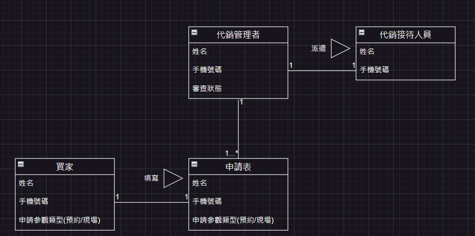

# 期中考-期中-Mid 
<!--(期中標籤註記，該行不能刪，作為驗證標籤，該檔案若沒該份標籤，代表直接貼上saample，直接0分)-->

>
>學號：111111109
> 
>姓名：張雅薰
> 

本份文件包含以下主題：(至少需下面兩項，若是有多者可以自行新增)
- [x] 答題

## 答題
>1. 

(a)
### 利害人關係表
| 利害人         | 目標 |
|----------------|-----------------------------------------------------------------------------------|
| 代銷管理者     |1.審核申請，確保時程合理安排。 2.根據申請情況安排接待人員。 3.提供申請失敗原因，引導預約型買家重新填寫申請。|
| 代銷接待人員 |1.根據申請類別帶客戶進行參觀。 2.確保客戶訊息準確。|
| 預約型買家     | 1.線上填寫資料選擇預約時段，等待通知。 2.收到預約成功通知接待並參觀物件。 3.收到失敗預約的通知，並重新填寫申請單。 4.方便地與代銷公司溝通，獲取相關房屋信息。|
| 現場即時參觀買家 | 1.線上填寫資料，安排現場參觀。 2.收到派遣代銷的參觀通知。 3.順利接待並參觀物件。 4.方便地與代銷公司溝通，獲取相關房屋信息。|

### 事件表
| 案例名稱                 | 案例描述                                                         |
|------------------------|------------------------------------------------------------------|
| 預約型買家申請預約     | 預約型買家填寫申請表，點選預約制 Line 選單後，再進行身分填寫，其內容需要有手機號碼、姓名與看房時段申請預約                         |
| 現場即時參觀買家申請參觀 | 現場即時參觀買家填寫申請表，點選現場制 Line 選單後，再進行身分填寫，其內容需要有手機號碼、姓名 |
| 審核申請                | 代銷管理者審核預約型買家與現場即時參觀買家的預約申請             |
| 預約成功推播消息        | 將成功預約信息推送給預約型買家，提醒預約成功                       |
| 預約失敗推播消息        | 將預約失敗信息推送給預約型買家，提醒重新填寫申請                   |
| 現場參觀派遣代銷        | 根據現場參觀申請，派遣閒置的代銷進行分配，並通知買家                |

(b)  
  
(c)
| 使用案例名稱| 預約型買家申請預約     |
|------------------------|------------------------------------------------------------------|
|使用案例描述|預約型買家填寫申請表，點選預約制 Line 選單後，再進行身分填寫，其內容需要有手機號碼、姓名與看房時段申請預約  |
|主要參與者| 預約型買家|
|利害關係人與目標|預約型買家：線上填寫資料選擇預約時段，等待通知。|
|前置條件|買家已加入Line bot公開頻道。 |
|後置條件|申請成功後，預約成功或失敗的信息將傳送給代銷公司進行審核。 |
|主要成功情節| 預約型買家填寫完申請表後，成功送出申請。 代銷管理者接收到預約申請，即可進行審核。|
|例外情節與其他需求|預約型買家未填寫完整申請表： 系統提醒預約型買家填寫完整資訊後再提交申請。 預約型買家填寫時段與已預約時段衝突： 系統提醒預約型買家選擇其他時段或重新選擇。 |

|使用案例名稱|現場即時參觀買家申請預約 |
|------------------------|------------------------------------------------------------------|
|使用案例描述|現場即時參觀買家填寫申請表，點選現場制 Line 選單後，再進行身分填寫，其內容需要有手機號碼、姓名。 |
|主要參與者|現場即時參觀買家|
|利害關係人與目標|現場即時參觀買家：線上填寫資料，安排現場參觀。|
|前置條件|買家已加入Line bot公開頻道。 |
|後置條件| 申請預約成功並傳送給代銷管理者進行審核。|
|主要成功情節| 現場即時參觀買家填寫完申請表後，成功送出申請。 代銷管理者接收到參觀申請，安排代銷人員接待。|
|例外情節與其他需求：|現場即時參觀買家未填寫完整申請表： 系統提醒現場即時參觀買家填寫完整資訊後再提交申請。 |

|使用案例名稱| 審核申請|
|------------------------|------------------------------------------------------------------|
|使用案例描述| 代銷管理者審核預約型買家與現場即時參觀買家的預約申請。|
|主要參與者| 代銷管理者|
|利害關係人與目標|代銷管理者： 1.審核申請，確保時程合理安排。 2.根據申請情況安排接待人員。 |
|前置條件|代銷公司接收到預約型買家或現場即時參觀買家的申請。 |
|後置條件|完成申請審核，通知結果交給代銷接待人員。 |
|主要成功情節| 代銷管理者對預約型買家或現場即時參觀買家的申請進行審核，通過申請。|
|例外情節與其他需求|申請資訊不完整： 代銷管理者通知買家重新填寫。 申請時程安排與其他已安排時程衝突： 代銷管理者重新安排時程或通知代銷接待人員調整。 |

|使用案例名稱|預約成功推播消息 |
|------------------------|------------------------------------------------------------------|
|使用案例描述| 將成功預約信息推送給預約型買家，提醒預約成功。|
主要參與者|代銷管理者、預約型買家 |
|利害關係人與目標|代銷管理者： 根據申請情況安排接待人員。 代銷接待人員： 確保客戶訊息準確。 預約型買家：收到預約成功通知接待並參觀物件。|
|前置條件|預約型買家的申請已審核通過並安排好接待人員。 |
|後置條件|預約型買家收到成功預約的通知。 |
|主要成功情節|代銷管理者將成功預約信息準確推播給預約型買家。 預約型買家收到通知後，確認預約成功。 |
|例外情節與其他需求|通知系統故障： 代銷管理者立即通知預約型買家，並提供其他聯絡方式。 |

|使用案例名稱| 預約失敗推播消息|
|------------------------|------------------------------------------------------------------|
|使用案例描述|將預約失敗信息推送給預約型買家，提醒重新填寫申請。 |
|主要參與者|代銷管理者、代銷接待人員、預約型買家 |
|利害關係人與目標|代銷管理者：提供申請失敗原因，引導預約型買家重新填寫申請。 代銷接待人員：確保客戶訊息準確。 預約型買家：收到失敗預約的通知，並重新填寫申請單。 |
|前置條件|預約型買家的申請無法成功安排時。 |
|後置條件| 預約型買家收到失敗預約的通知。|
|主要成功情節|代銷管理者將失敗預約信息準確推播給預約型買家，提供失敗原因。 預約型買家收到通知後，了解失敗原因並重新填寫申請。 |
|例外情節與其他需求|通知系統故障： 代銷管理者需儘快通知預約型買家，並提供其他聯絡方式。 |

|使用案例名稱|現場參觀派遣代銷 |
|------------------------|------------------------------------------------------------------|
|使用案例描述|根據現場參觀申請，派遣閒置的代銷進行分配，並通知買家。 |
|主要參與者|代銷管理者、代銷接待人員、現場即時參觀買家 |
|利害關係人與目標|代銷管理者： 根據申請情況安排接待人員。 代銷接待人員：根據申請類別帶客戶進行參觀。 現場即時參觀買家： 收到派遣代銷的參觀通知。 |
|前置條件| 現場即時參觀買家的申請已審核通過。|
|後置條件|代銷管理者已安排代銷進行參觀，並通知買家。 |
|主要成功情節|代銷管理者根據現場參觀申請，選擇合適的代銷進行派遣，並通知相關人員。 代銷成功接受派遣並準備接待現場即時參觀買家。 |
|例外情節與其他需求| 無閒置代銷可用： 代銷管理者需立即安排其他可用代銷進行接待，並通知買家。 派遣代銷臨時取消： 代銷管理者需盡快通知買家，重新安排代銷進行接待。|

(d) 
 
>2. 

(a)
### 利害人關係表
| 利害人     | 目標                                                         |
|------------|--------------------------------------------------------------|
|   申請者(民眾)  |1. 提交正確的個人資料，以符合政策要求。 2. 通過審核，取得補助金。 3確保個人資訊安全。 |
| 政府機關人員 |1. 確保申請者提交的資料符合政策要求。 2. 審核資料。 3. 正確生成普發名單，以便後續發放補助金。 4. 確保系統運行正常，及時發現並處理任何異常情況。 |
| 戶政系統|1. 確保申請者提供的身分證字號或居留證號與個人資料一致。 | 
|   金融機構  | 1. 確保申請者提供的金融帳戶與個人資料一致。 2 遵守相關法規，保護客戶隱私。 3. 確保金融資訊安全，防止詐騙行為。|
|  健保局  | 1. 確保申請者提供的健保卡資訊與個人資料一致。 2. 配合政府政策。|

### 事件表
| 案例名稱           | 案例描述                                                         |
|------------------|------------------------------------------------------------------|
| 申請資訊填寫     | 申請者進入網站填寫資料，包括身分證字號、金融代號、帳號和健保卡號等。 |
| 申請資訊確認     | 申請者在填寫完資訊後進行最後一次確認，確認無誤後提交申請。|
| 申請資格審核     | 政府機關人員、戶政系統、金融機構以及健保局對申請者提交的資料進行審核，確保申請者符合政策要求。|
| 申請資訊查詢     | 政府人員進入後台系統查詢每日提交的申請資訊，確保系統正常運行並及時發現任何異常資訊。|
| 普發名單生成     | 根據政府機關人員的審核結果，將符合資格的申請者寫入普發名單，準備後續發放補助金。 |

(b)

(c)

(d)

